# 🏪 SweetShop - Enterprise E-Commerce Platform


> **PLACEHOLDER: Add a high-resolution screenshot of the Home Page here**  
> ``

An enterprise-grade, highly scalable e-commerce platform built with **ASP.NET Core**. Designed following modern architectural principles to handle high traffic and complex business requirements. This project serves as a robust foundation for building commercial SaaS e-commerce applications.

---

## ✨ Project Overview & Features

SweetShop is meticulously crafted with performance, maintainability, and security at its core. It incorporates advanced design patterns and cloud-ready infrastructure out of the box.

### 🌟 Key Features
- **Clean Architecture & CQRS**: Built with a highly structured MVC approach utilizing the **Mediator pattern** (MediatR) for a strict separation of concerns between Commands and Queries.
- **High Performance Caching**: Employs **Redis Caching** alongside In-Memory caching using the Decorator pattern to drastically reduce database hits and enhance response speeds.
- **Robust Security**: Enforces **Rate Limiting** to defend against DDoS attacks, credential stuffing, and burst abuse.
- **Reliable Payments**: Deep integration with **Stripe**, utilizing **Stripe Webhooks** for secure and asynchronous payment finalization.
- **Cloud Storage**: Seamlessly scalable product image handling via **Azure Blob Storage**.
- **Background Processing**: Implements **Background Workers** (`IHostedService`) for decoupled, deferred tasks like nightly financial reporting.
- **Data Integrity**: Centralized, modular validation pipelines powered by **FluentValidation** integrated directly into MediatR.
- **DevOps Ready**: Fully containerized environment using **Docker**, supplemented by automated CI/CD pipelines via **GitHub Actions**.
- **Dual Dashboards**: Segregated and secure workspaces for Administration (`admin-dashboard`) and Inventory Management (`inventory-dashboard`).
- **Localization**: Built-in multi-language support (English & Arabic).

---

## 🏗️ Architecture Diagram

The system employs a layered, modular architecture. Below is a structural flow representing how a client request is handled:

```mermaid
graph TD
    Client[📱 Web Browser / Mobile App] --> |HTTP/HTTPS| CDN[🛡️ Rate Limiting Middleware]
    CDN --> WebApp[⚙️ ASP.NET Core Web Application]

    subgraph "Application Layer (CQRS)"
        WebApp --> Controllers[🔌 API & MVC Controllers]
        Controllers --> Commands[📝 MediatR Commands]
        Controllers --> Queries[🔍 MediatR Queries]
        Commands --> Validation[✅ FluentValidation Pipeline]
        Validation --> Handlers[🧠 Command/Query Handlers]
    end

    subgraph "Infrastructure Layer"
        Handlers -.-> Cache[⚡ Redis / Memory Cache]
        Handlers -.-> EFCore[🗄️ Entity Framework Core]
        Handlers -.-> Blob[☁️ Azure Blob Storage]
        Handlers -.-> Payment[💳 Stripe Webhooks]
        Handlers -.-> Email[📧 SMTP Email Service]
    end

    subgraph "Data Sources"
        EFCore --> SQL[(SQL Server Database)]
    end

    subgraph "Hosted Services"
        Worker[⚙️ Nightly Report Worker] -.-> EFCore
        Worker -.-> Email
    end
```



---

## 💻 Technologies Used

| Category | Technology / Library |
| :--- | :--- |
| **Framework** | .NET 8, ASP.NET Core MVC & Web API |
| **Architecture** | CQRS, Mediator Pattern, Decorator Pattern |
| **Data Access** | Entity Framework Core, SQL Server |
| **Caching** | Redis (Distributed Cache), IMemoryCache |
| **Messaging** | MediatR |
| **Validation** | FluentValidation |
| **Cloud Storage** | Azure Blob Storage |
| **Payments** | Stripe Integration & Webhooks |
| **Security** | ASP.NET Core Identity, Rate Limiting |
| **Background Jobs** | IHostedService (Background Worker) |
| **DevOps & Deployment**| Docker, Docker Compose, GitHub Actions |

---

## 🚀 Prerequisites & Getting Started

### Prerequisites
Before you begin, ensure you have the following installed on your machine:
1. [Docker Desktop](https://www.docker.com/products/docker-desktop)
2. [.NET 8 SDK](https://dotnet.microsoft.com/download/dotnet/8.0) (If running outside Docker)
3. A [Stripe](https://stripe.com/) Developer Account
4. An [Azure Storage](https://azure.microsoft.com/en-us/services/storage/) account (for production storage)

### Quick Start with Docker

The fastest way to spin up the entire application stack—including the SQL Database and Redis Cache—is using Docker Compose.

1. **Clone the repository:**
   ```bash
   git clone https://github.com/your-username/SweetShop.git
   cd SweetShop
   ```

2. **Configure Environment Variables:**
   Rename `appsettings.Development.json.example` to `appsettings.Development.json` (or just edit your `appsettings.json`) and populate the required keys. See the [Environment Variables](#-environment-variables) section below.

3. **Run the Stack:**
   ```bash
   docker-compose up --build -d
   ```
   > 💡 *This command automatically pulls necessary images, builds the ASP.NET Core application, runs EF Core Migrations, and starts all services.*

4. **Access the Application:**
   - **Storefront:** `http://localhost:8080`
   - **Admin Dashboard:** `http://localhost:8080/Admin`
   - **Swagger API Docs:** `http://localhost:8080/swagger`

> **PLACEHOLDER: Add a screenshot of the Application running in a Docker container or Terminal output**  
> ``

---

## 🔐 Environment Variables

To properly launch the framework locally or in production, define the following variables in your configuration files (`appsettings.json` / Key Vault / Environment variables).

*⚠️ Important: Never commit production secrets to Git!*

```json
{
  "ConnectionStrings": {
    "DefaultConnection": "Server=tcp:yourserver,1433;Initial Catalog=SweetShop;Persist Security Info=False;User ID=youruser;Password=yourpassword;MultipleActiveResultSets=False;Encrypt=True;TrustServerCertificate=False;Connection Timeout=30;"
  },
  "Redis": {
    "Configuration": "127.0.0.1:6379,abortConnect=False"
  },
  "Stripe": {
    "SecretKey": "sk_test_...",
    "PublishableKey": "pk_test_...",
    "WebhookSecret": "whsec_..."
  },
  "AzureBlobStorage": {
    "ConnectionString": "DefaultEndpointsProtocol=https;AccountName=...;AccountKey=...;EndpointSuffix=core.windows.net",
    "ContainerName": "sweetshop-images"
  },
  "EmailConfiguration": {
    "SmtpServer": "smtp.mailtrap.io",
    "SmtpPort": 2525,
    "SmtpUsername": "your_username",
    "SmtpPassword": "your_password",
    "SenderName": "SweetShop Support",
    "SenderEmail": "no-reply@sweetshop.com"
  }
}
```

---

## 📚 API Documentation & Swagger

> **PLACEHOLDER: Add a screenshot of the Swagger UI showcasing the API endpoints**  
> ``

SweetShop provides a fully documented RESTful API layer out of the box. This makes it seamless to integrate a mobile application (Flutter / React Native) or Headless CMS in the future.

The API is self-documented using **Swashbuckle (Swagger)**.

- **Interactive UI Endpoint:** `/swagger`
- **OpenAPI 3.0 JSON Specification:** `/swagger/v1/swagger.json`

### Core API Resources (Examples)
- `GET /api/Products` — Retrieve a paginated layer of active products.
- `GET /api/Products/{id}` — Fetch detailed product & variation data.
- `POST /api/Orders` — Securely checkout and process an order payload.
- `POST /api/webhooks/stripe` — Strictly for Stripe asynchronous event handling.

---

## 🤝 Contributing & Licensing

Contributions to the codebase are what make open-source development shine. If you have an optimization edge case or a feature idea to expand this boilerplate, feel free to submit a PR!

1. Fork the Project
2. Create your Feature Branch (`git checkout -b feature/NewFeature`)
3. Commit your Changes (`git commit -m 'Add NewFeature'`)
4. Push to the Branch (`git push origin feature/NewFeature`)
5. Open a Pull Request

**License:** Distributed under the MIT License. See `LICENSE` for more information.

---
*Architected and developed with ❤️ by a Senior Software Engineer.*
